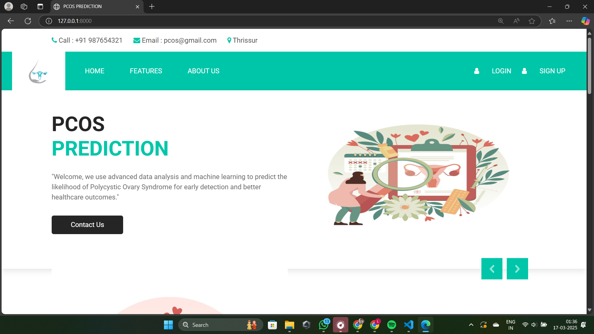
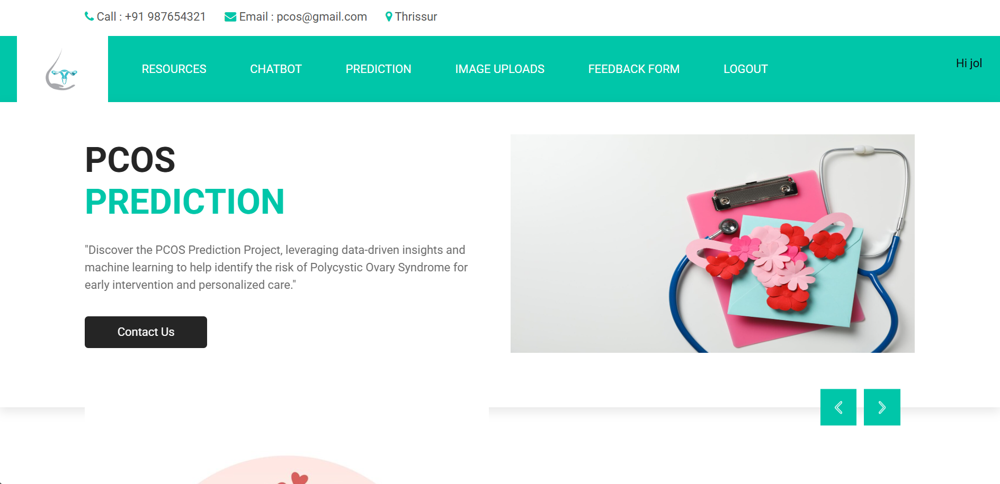
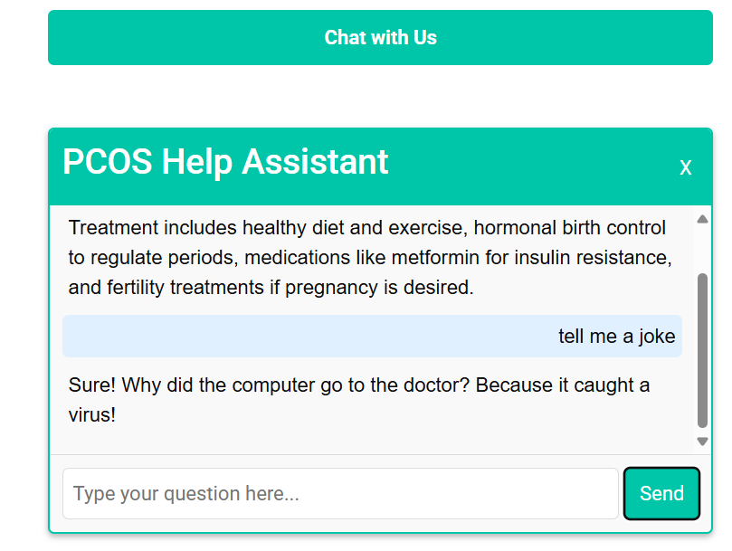
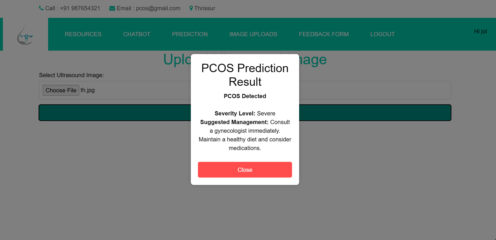
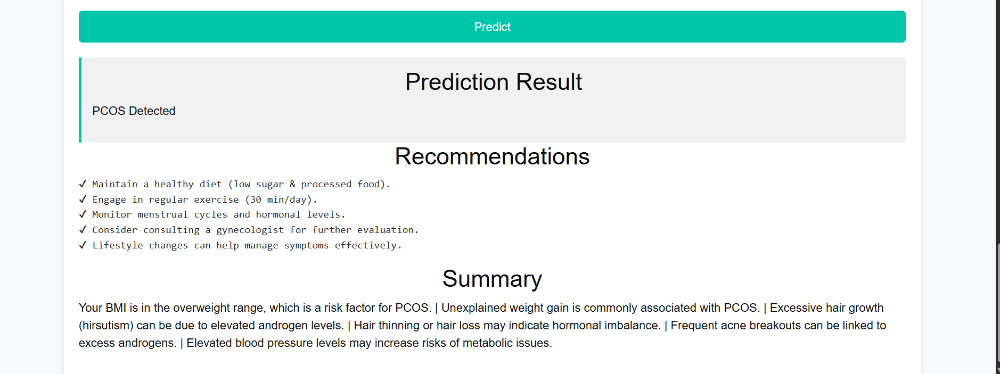

# PCOS Prediction Tool 🩺✨

A web-based application that helps predict the likelihood of **Polycystic Ovary Syndrome (PCOS)** using machine learning models and provides educational support through an chatbot. Designed with a user-friendly interface to assist both patients and healthcare providers.

---

## 🖼️ Project Screenshot







> 📌 Add your screenshot to the `images` folder and update the path above.

---

## 🔍 Features

- ✅ Predict PCOS risk using a trained ML model
- 🧠 chatbot for user support and health guidance
- 📊 Visual output and reports based on input health parameters
- 🧬 Supports image-based cyst detection using CNN (Ultrasound)
- 🌐 Simple, responsive, and informative front-end interface

---

## 🛠️ Tech Stack

- **Frontend:** HTML, CSS, JavaScript, Bootstrap
- **Backend:** Python (Django)
- **Database:** dbSqlite3
- **Machine Learning:** Scikit-learn, CNN for ultrasound image analysis
- **Chatbot:** Self trained chatbot with set of queries

---

## 🏥 Use Case

This tool can assist:
- Doctors in early diagnosis
- Women in understanding health risks
- Clinics and researchers for early screening automation

---


## 🏥 Data set
Data set where taken as secondary source from kaggle 

## 📁 How to Run

```bash
# Clone the repo
git clone https://github.com/Anwin-akz/Pcos-Predicition-Tool.git

# Navigate to project directory
cd Pcos-Predicition-Tool

# Run the app
python app.py
